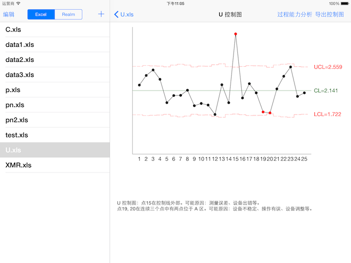
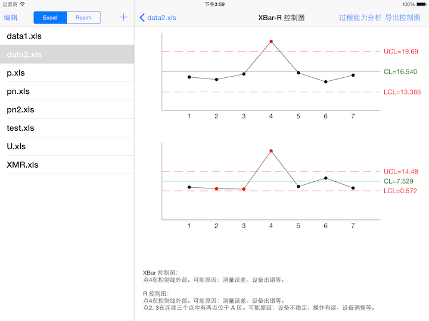
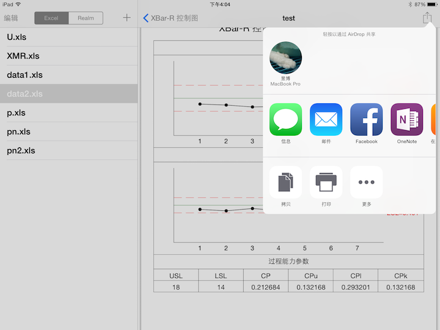
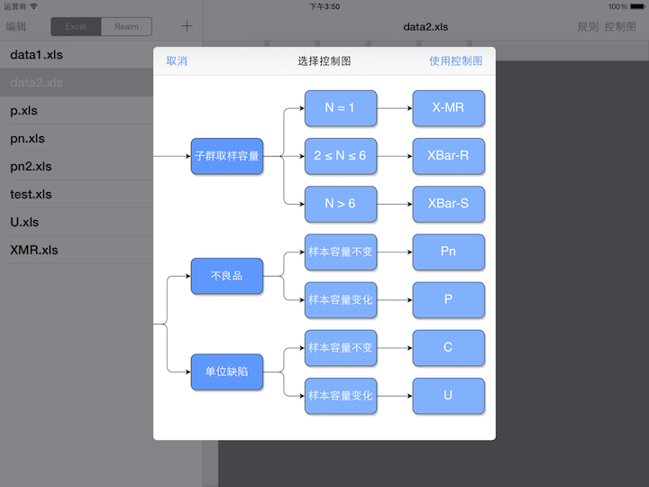
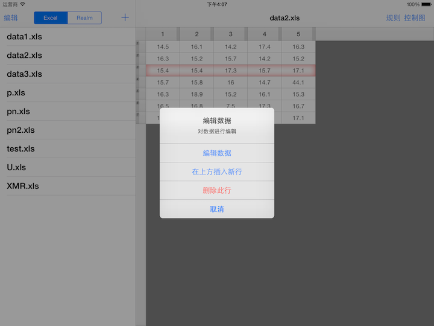
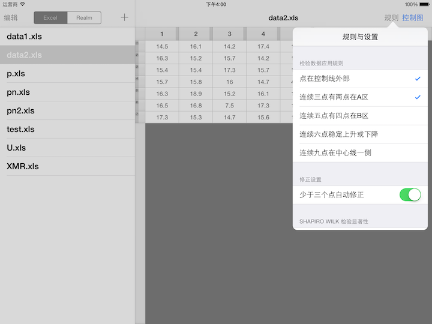

QualityKit
======================
An iOS application to draw control charts

# Introduction

QualityKit is an iOS application used in Industrial Engineering field, helping to draw control charts and do some simple process  capability analysis.

Also, QualityKit could refer to the core framework of the application. QualityKit Framework is an Objective-C framework for Industrial Engineering and Quality Management, including data structure definitions, data calculating, statistical constants, graph drawing, etc. This framework would be open-sourced after a total cleaning.

* Language：Objective-C, C++, C
* Platform：iOS
* Database：Realm, SQLite

## Screenshots

### Draw control charts



### Comparison between charts



### Generate PDF/PNG format report



### Visualized guide based on data



### XLS/DB data read/write



### Apply check and correct algorithms



## Binary

You can deploy `HQSQualityKit.ipa` in Release to iPad through iTunes.

## Source Code

The project is developed using Xcode 6.3.1 under OS X 10.10.3. The source code could be freely cloned to local repository. For the first time, it’s necessary to run `pod install` under the QualityKit directory. If CocoaPods is not installed, you should run `sudo gem install cocoapods` in advance.

## Sample Data

Copy the data in SampleData directory to Documents in sandbox.

# Model

Model section is used to process the operation logic, calculating data, local file and database IO, define data models, etc. The model section mainly run in background thread. 

## QKDef

Macro definitions and statistical constants.

## QKDataAnalyzer

The module which process data under specific rules of control charts. The class methods is described in header file as below.

```objc
/**
 *  Get statistical characteristic values of data.
 *
 *  @param dataArr  Original data array
 *  @param rulesArr The rules to be applied to data
 *  @param type     Type of control chart, e.g. C Chart，XBar-R Chart, etc
 *  @param block    Callback block, including UCL Value, LCL Value, CL Value, data points in graph, indexes of error points in graph, and error description
 */
+ (void)getStatisticalValuesOfDoubleArray:(NSArray *)dataArr checkRulesArray:(NSArray *)rulesArr controlChartType:(NSString *)type withBlock:(void(^)(id UCLValue, id LCLValue, float CLValue, NSArray *plotArr, NSArray *indexesOfErrorPoints, NSString *errorDescription))block;

/**
 *  Calculating data
 *
 *  @param dataArray Original data array
 *  @param type      Type of control chart
 *  @param block     Callback block，including UCL Value, LCL Value, CL Value, data points in graph
 */
+ (void)calculateControlLineValuesOfData:(NSArray *)dataArray controlChartType:(NSString *)type block:(void(^)(id UCLValue, id LCLValue, float CLValue, NSArray *plotArr))block;

/**
 *  Examine the data points of graph
 *
 *  @param plotArray Data points of graph
 *  @param UCL       UCL Value
 *  @param LCL       LCL Value
 *  @param CL        CL Value
 *  @param checkRule Rules of examining data, defined in QKDef
 *  @param block     Callback block，including the indexes of error points and error description
 */
+ (void)checkData:(NSArray *)plotArray UCLValue:(id)UCL LCLValue:(id)LCL CLValue:(float)CL rule:(NSString *)checkRule block:(void(^)(NSArray *indexesOfErrorPoints, NSString *errorDescription))block;

/**
 *  Fix the error points. The number of initial error points couldn’t be 0.
 *
 *  @param dataArr            Original data
 *  @param indexesOfErrorRows Indexes of error points, aka the indexes of rows of original data where error occurs
 *  @param rulesArr           Rules of examining data, defined in QKDef
 *  @param type               Type of control charts
 *  @param block              Callback block，including the indexes of error points and error description
 */
+ (void)fixData:(NSArray *)dataArr indexesOfErrorRows:(NSArray *)indexesOfErrorRows checkRules:(NSArray *)rulesArr controlChartType:(NSString *)type block:(void(^)(id UCLValue, id LCLValue, float CLValue, NSArray *plotArr, NSArray *indexesOfErrorPoints, NSString *errorDescription))block;

/**
 *  Apply saved control chart to data
 *
 *  @param dataArr  Original data array
 *  @param UCLValue UCL Value
 *  @param LCLValue LCL Value
 *  @param CLValue  CL Value
 *  @param rulesArr Rules of examining data
 *  @param type     Type of control chart
 *  @param block    Callback block
 */
+ (void)getStatisticalValuesUsingSavedControlChartFromData:(NSArray *)dataArr UCL:(id)UCLValue LCL:(id)LCLValue CL:(float)CLValue checkRulesArray:(NSArray *)rulesArr controlChartType:(NSString *)type withBlock:(void(^)(NSArray *plotArr, NSArray *indexesOfErrorPoints, NSString *errorDescription))block;
```

## QKStatisticalFoundations

The Objective-C wrap of statistical methods. The class methods are defined in header files, most of which don’t need additional comments.

```objc
+ (float)sumValueOfArray:(NSArray *)array;
+ (float)averageValueOfArray:(NSArray *)array;
+ (float)maximumValueOfArray:(NSArray *)array;
+ (float)minimumValueOfArray:(NSArray *)array;
+ (float)standardDeviationValueOfArray:(NSArray *)array;
+ (float)rangeValueOfArray:(NSArray *)array;

/**
 *  Rearrange as a ascending array
 *
 *  @param array Input array
 *
 *  @return Return the ascending array
 */
+ (NSArray *)ascendingArray:(NSArray *)array;

/**
 *  Rearrange as a descending array
 *
 *  @param array Input array
 *
 *  @return Return the descending array
 */
+ (NSArray *)descendingArray:(NSArray *)array;

/**
 *  Shapiro-Wilk Normality Test
 *
 *  @param array The array to be tested.
 *
 *  @return BOOL value if the data is normally distributed.
 */
+ (BOOL)shapiroWilkTest:(NSArray *)array;
```

## QKProcessCapabilityAnalysis

Wrap for process capability analysis.

## QKDataManager

Wrap for data IO.

## QKDataProcessor

Data type converted. Supported types including Realm Object, NSArray, TSTableViewModel, QZWorkbook, etc.

## QKExportManager

Export control chart.

## Data Model

### QKData5

Data structure of standard control charts like XBar-R. Subclass of Realm Object.

### QKSavedControlChart

Data structure of saved control charts as below.

* _name_: NSString
* _controlChartType_: NSString, macro definition based on QKDef
* _UCLValue_: NSData, NSKeyedArchiver-archived NSNumber or NSArray
* _LCLValue_: NSData
* _CLValue_: float
* _subUCLValue_: NSData
* _subLCLValue_: NSData
* _subCLValue_: float

# View

View section is used for drawing UIViews especially control charts on UIWindow and usually run in main thread.

## QKControlChartView

The subclass of UIView to draw control charts with properties as below.

* _dataArr_: NSArray, original data array
* _UCLValue_: id, UCL Value or array，possibly NSNumber or NSArray
* _LCLValue_: id
* _CLValue_: float
* _indexesOfErrorPoints_: NSArray, the indexes of error points

## MsgDisplay

Used for displaying messages.

# Controller

Controller respond to operations on View layer and pass it to Model layer, and update View layer using analyzed data from Model layer.

## MainSplitViewController

The RootViewController of this project, managing the Master-Detail controller and initialize log-in views.

## MasterViewController

List Excel or Realm data.

## DetailViewController

Display or edit the selected data.

## ControlChartViewController

Draw and export control chart by the chosen type and data with the following properties.

* _chartType_: NSString
* _dataArr_: NSArray
* _savedControlChart_: QKSavedControlChart. If you don’t want to use saved control chart, this should be left `nil`
* _usingSavedControlChart_: Bool. Whether the saved control chart is in use

# RulesTableViewController

Choose the rules in examination. Auto-Fix switch. Shapiro Wilk test.

## ProcessCapabilityViewController

Process capability analysis. The report could be generated into PDF.

### Delegate

* `- (void)pushPDFPreviewViewControllerWithFileName:(NSString *)fileName;`

## SelectControlChartViewController

Select proper type of control chart through graph.

### Delegate Methods

* `- (void)selectXBarRChart;`
* `- (void)selectXBarSChart;`
* `- (void)selectXMRChart;`
* `- (void)selectPChart;`
* `- (void)selectPnChart;`
* `- (void)selectCChart;`
* `- (void)selectUChart;`
* `- (void)generateChartWithSavedChart:(QKSavedControlChart *)savedChart;`

## SavedChartTableViewController

Explore and delete the saved control charts.

# Acknowledgements

I would like to extend my sincere gratitude to the included open-source projects, without which this project would never be completed.

To meet specific demands of this project, some open-source projects were modified manually and forked into my own repositories instead of being managed by CocoaPods. 
